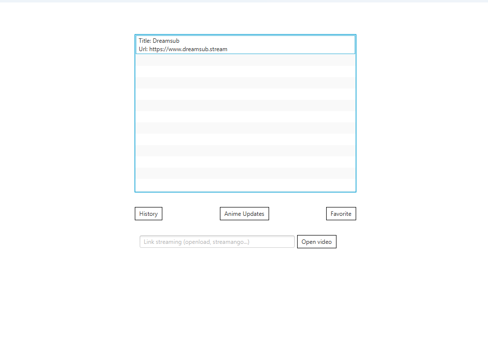
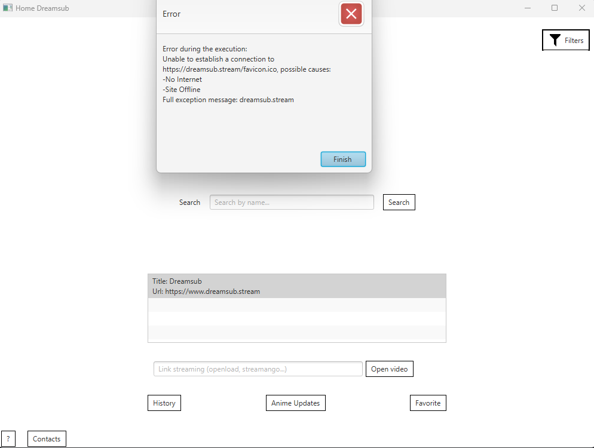

# AnimeViewer

An old program I made for watching anime using JavaFX.

**To be clear, I made this project in 2019. I only updated the README in 2024 and changed the release to Java 21**.

Sadly JavaFX was removed form the JRE, making everything way more complicated.

When I made this project, I wanted it to be modular, so that anyone would be able to create an extension to make it work for another site. I took inspiration for this from the great Tachiyomi, which sadly had to stop development.

## Requirements

- Java 21
- Maven

## Getting started

To run the application, use: `mvn javafx:run`.

## Examples

As this project was made years ago and uses a scraper to obtain the data needed, it doesn't work anymore.

I'll still include some screenshot to show how it looks like (pretty bad), but the images, the search etc. won't work.

